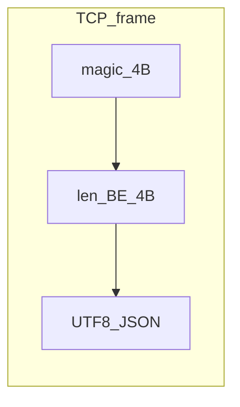

<!--
  author: wei
  copyright @2026 agora.io
  date: 2026-04-24 21:31:37
  revised: 2026-04-29 — 实施语言与交付物说明已替换为当前 C11 实现、Makefile 构建与 examples/tests 布局
-->

# Agora-Hex TCP JSON 协议实现计划

## 已定决策（与当前实现对齐）

1. **交付范围**：除协议库与单元测试外，包含较完整的 TCP demo，包括独立 client/server、可配置监听地址/端口，以及按消息类型与 `callId` 输出日志。
2. **实现语言**：**C11**，使用根目录 `Makefile` 构建，JSON 解析/序列化依赖仓库内嵌的 `cJSON`，帧头长度字段使用大端 `uint32`。

## 文档依据（已读 PDF，忽略序列图）

来源：[agora-hex-3.pdf](./agora-hex-3.pdf)（6 页正文）。

**传输层**

- 承载：**TCP**。
- 每条消息：**8 字节头 + JSON 文本（UTF-8）**。
  - 字节 0-3：魔数 `0xaa, 0xaa, 0x55, 0x55`。
  - 字节 4-7：整包长度，**大端 uint32**，值为 `len(JSON字节) + 8`（JSON 的 UTF-8 字节长度 + magic 4 + length 4）。当前 C 实现中由 `agorahex_frame_encoded_size(json_len)` 计算总长，由 `agorahex_frame_encode` 写入帧头。
  - 字节 8 起：完整 JSON 字符串。

**消息类型与方向**（PDF 第 4 页表）

| 顶层键 | 方向 |
|--------|------|
| `AgoraDialInIndication` | Agora → Hex |
| `AVCDialInRequest` | Hex → Agora |
| `AVCDialInReply` | Agora → Hex（回应 `AVCDialInRequest`） |
| `HangupIndication` | 双向；每个 `AgoraDialInIndication` / `AVCDialInRequest` 必须最终有对应 `HangupIndication` |
| `MutedIndication` | 双向 |
| `AVCNameChangedIndication` | Hex → Agora |
| `AgoraStartContentIndication` | Agora → Hex（默认无需应答） |
| `AVCStartContentRequest` | Hex → Agora |
| `AVCStartContentReplay` | Agora → Hex（`accept` true/false） |
| `StopContentIndication` | 双向 |

**`callId` 规则**（PDF 第 5 页）

- 仅 **`AgoraDialInIndication`** 与 **`AVCDialInRequest`** 使用 uuid **新建** `callId`。
- 其余消息必须从已建立的上述两类消息中**沿用同一** `callId`。

**双流 / 抢双流**（PDF 第 1-3 页，文字规则）

- 实现层以**状态机或业务回调**处理即可：协议层只保证消息类型与字段可解析；文档中的分支（如 `AVCStartContentReplay(accept=false)` 后是否还有 `StopContentIndication`）由上层逻辑遵守，不在传输层硬编码流程。

**字段形状**

- PDF 未逐字段定义嵌套结构；以仓库内样例为权威补充：[json_msg/](./json_msg/) 下各 `.txt`（如 `AgoraDialInIndication`、`AVCDialInReply` 中的 `agoraEndpoint`、`avcLeg`、各 `*Property` 嵌套）。



## 已实现仓库布局（当前 C 实现）

- **构建入口**：[../Makefile](../Makefile)
- **对外头文件**：[../include/agorahex/](../include/agorahex/) - `framing.h`、`envelope.h`、`types.h`、`result.h`
- **库实现**：[../src/](../src/) - `framing.c`、`envelope.c`、`result.c`
- **示例程序**：[../examples/](../examples/) - `hexagora_server.c`、`hexagora_client.c`
- **测试代码**：[../tests/](../tests/) - `test_framing.c`、`test_envelope.c`、`test_samples.c`
- **第三方 JSON 库**：[../third_party/cJSON/](../third_party/cJSON/)
- **构建产物目录**：`../build/`，包含 `libagorahex.a`、`hexagora-server`、`hexagora-client` 及 `build/obj/` 下的中间对象文件

构建与运行示例（在仓库根目录执行）：

```bash
make
make test
./build/hexagora-server -listen :9876
./build/hexagora-client -addr 127.0.0.1:9876 -sample hangup
./build/hexagora-client -addr 127.0.0.1:9876 -file docs/json_msg/HangupIndication.txt
```

`make test` 会执行 `tests/test_framing.c`、`tests/test_envelope.c`、`tests/test_samples.c`；其中 `test_samples` 由 `Makefile` 切换到 `docs/` 目录运行，以校验 `docs/json_msg/` 下的样例消息。

## 当前交付物（C，与实现对齐）

1. **帧编解码**
   - 头文件与实现：`include/agorahex/framing.h`、`src/framing.c`
   - 关键接口：`agorahex_frame_encoded_size`、`agorahex_frame_encode`
   - 流式拆帧：`agorahex_frame_decoder_t`、`agorahex_frame_decoder_append`
   - 行为：支持粘包/半包；默认最大帧长 4 MiB；遇到坏 magic、过短帧、超长帧或回调错误后保留 `last_error`，需调用 `agorahex_frame_decoder_reset` 清空错误状态

2. **信封解析与序列化**
   - 头文件与实现：`include/agorahex/envelope.h`、`include/agorahex/types.h`、`src/envelope.c`
   - 关键类型：`agorahex_kind_t`、`agorahex_message_t`
   - 关键接口：`agorahex_parse_envelope`、`agorahex_marshal_envelope`、`agorahex_message_free`
   - 行为：顶层 envelope 严格校验，必须是对象、必须仅包含一个顶层键、且该键必须属于已知 kind；嵌套字段按当前样例结构解析，未知嵌套字段忽略

3. **错误码与错误描述**
   - 头文件与实现：`include/agorahex/result.h`、`src/result.c`
   - 关键类型：`agorahex_result_t`
   - 关键接口：`agorahex_strerror`

4. **测试**
   - `test_framing`：round-trip、两帧粘连、半包、坏 magic、最小长度、最大长度约束
   - `test_envelope`：单顶层键约束、未知消息类型、marshal/parse 回归
   - `test_samples`：对 `docs/json_msg/*.txt` 进行解析与成帧回归

5. **Demo**
   - `hexagora-server`：TCP 监听、`poll` 驱动、多连接，每个连接持有独立 `agorahex_frame_decoder_t`，收到消息后打印 kind 和 `callId`
   - `hexagora-client`：连接对端后发送一条完整 envelope，支持 `-sample hangup|muted|start_content_request` 或 `-file <path>`

## 命名与 PDF 一致

- PDF 使用 **`AVCStartContentReplay`**（非 Reply）；当前 C 枚举、解析器和序列化结果均与 PDF 及样例文件保持一致。

## 当前实现约定

- **顶层严格、嵌套宽松**：`agorahex_parse_envelope` 对顶层结构严格校验，但对嵌套字段采用按需提取策略，未知字段默认忽略。
- **默认帧长上限**：`agorahex_frame_decoder_init(..., 0)` 会回退到 `AGORAHEX_DEFAULT_MAX_FRAME_BYTES`，即 4 MiB。
- **资源释放约定**：解析或组装后只要 `agorahex_message_t` 内含堆上字符串字段，调用方都应使用 `agorahex_message_free` 释放。
- **样例文件位置**：当前样例文件以 `docs/json_msg/` 为准，而不是仓库根目录下的 `json_msg/`。

## 历史说明

- 此前文档中的 Go module、`internal/agorahex`、`cmd/hexagora-*`、`go test`、`go build` 等说明，已全部由当前 C11 实现的目录结构、`Makefile`、`examples/` 与 `tests/` 布局替代。
- 协议语义本身未变，变化仅在实现语言、构建方式与代码组织形式。
